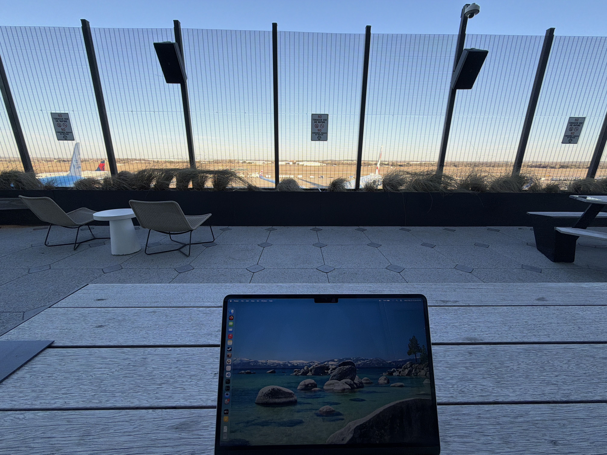
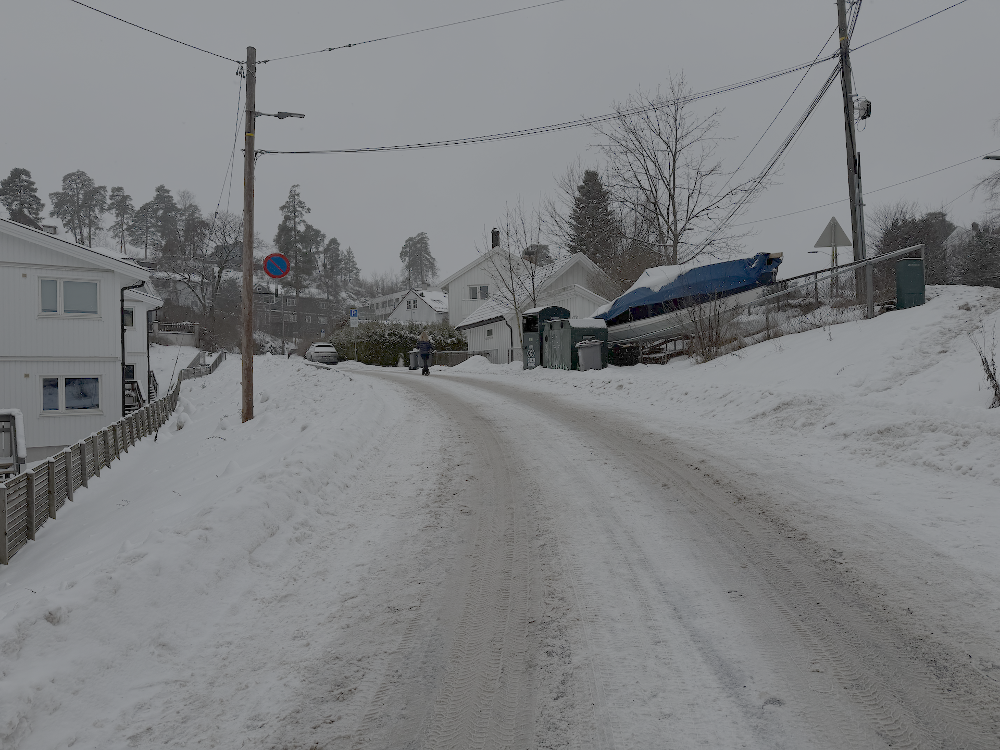
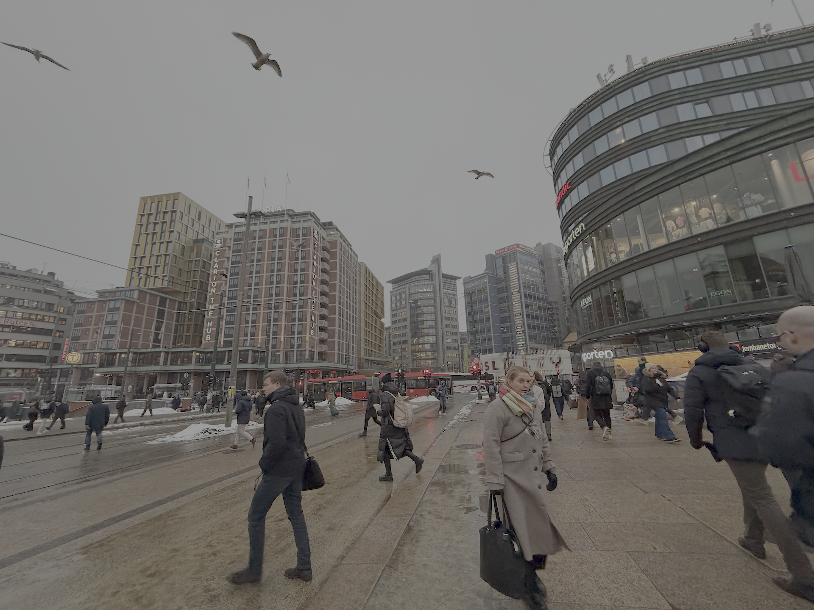
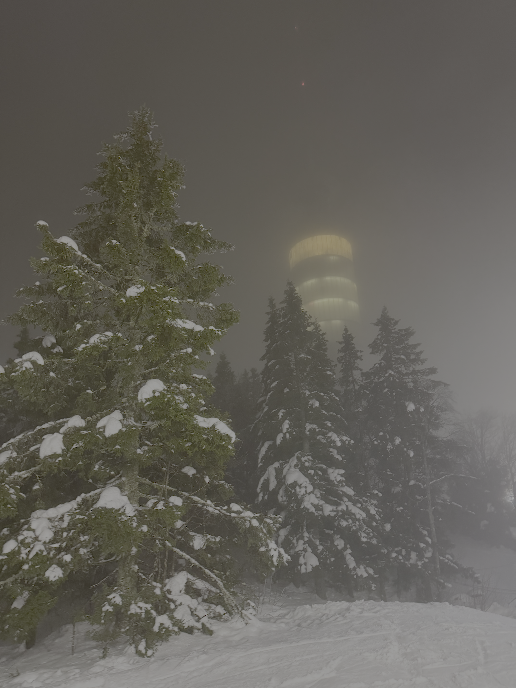
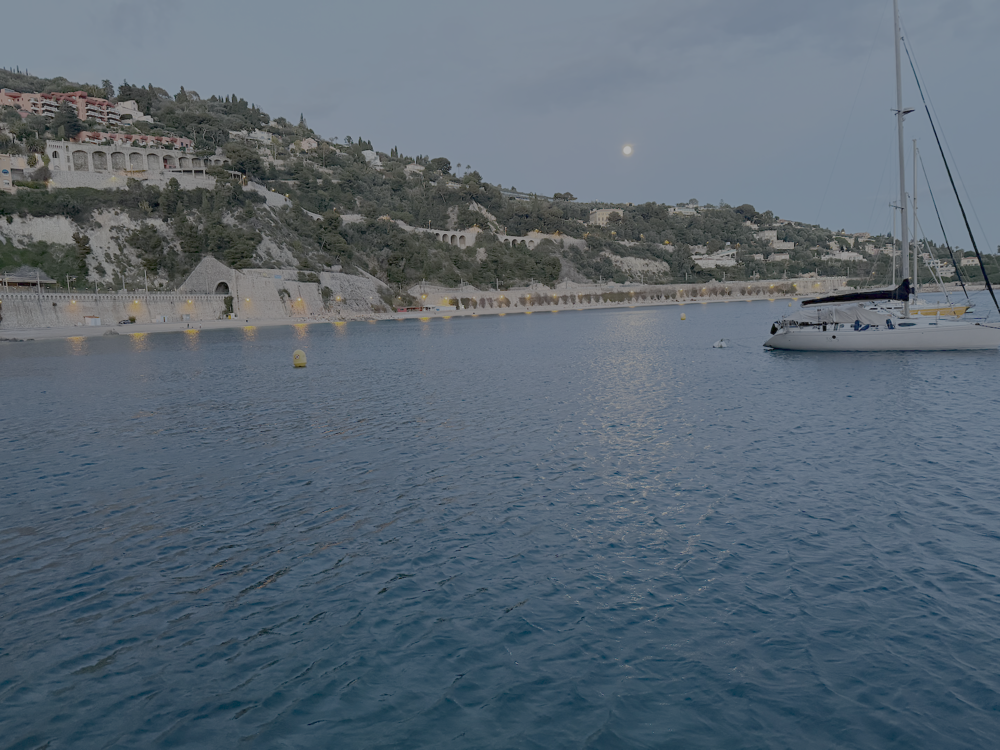

I had the opportunity to have a reunion with some friends during my middle school years in Paris. I had not seen these people for almost a decade but have stayed in contact weekly. I think being outsiders in a foreign country really makes expats form lasting bonds with each other for support. But enough about that, I wanted to give an outline of the trip and some of my observations. Experienced travelers may already know many things in this post but hopefully you'll learn at least one interesting thing.

## Monday, February 23

I logged out of work a bit early to officially start my vacation. I get through the line in AUS very quickly as usual and enjoy the beautiful February weather in the outdoor patio (thanks Jon for telling me about this). I've heard lines for morning flights can be really bad, but I like my sleep too much to buy a morning flight if I have a choice. Therefore, going through AUS has always been very smooth for me.

I booked this flight through American but it was operated by British Airways. The only thing I remember is that they served the worst slop I had ever tasted on a plane in my life. Well, the main course was fine, but the vegetable side was some tasteless mushy multicolored unidentifiable bean thingies. It was so bad it was the first time I physically could not finish an airline meal.

## Tuesday, February 24

I land in the morning at Heathrow for a nine hour layover. I purposely picked this flight so I could have a day exploring London by myself, which was a great decision.

I was very impressed by the experience leaving Heathrow. They had automated gates for US citizens that let you through after just a quick scan of your passport. It's a bit ridiculous that immigration can be easier for Americans in a foreign airport than in an American airport, where you have to wait for a human to approve your documents.

I took the Heathrow Express which was pricey for a train at 30 pounds for a return ticket but still cheaper than what I paid for a one-way rideshare to AUS. I think this is the first time since I moved away from Europe taking a high speed train and I definitely forgot how nice it was. It took 15 minutes to get to the city center, but I wouldn't even have minded if it was longer because I could look out the window at the landscape zooming by, stetch my legs and walk around, or do something productive.

I was looking forward to the speed but I was most surprised by the noise, or rather the lack thereof. Driving a car at 100 MPH is loud and bumpy but the train was very quiet and so smooth I would be comfortable drinking out of a cup, which is normally a risky endeavor in a car to avoid spilling water all over yourself. Overall it was a very refined experience and made me wish we could have such things in America.

<video src="/heathrow-express.mov" autoplay loop muted playsinline></video>

<em>For the train enthusiasts out there</em>

I spent the day walking around and dropping into the Visa London office. I immediately noticed the stereotype that Europeans dress more formally is true. I can't recall seeing any T-shirts while they would be commonplace in Austin. Or maybe that office only houses the legal department. I felt out of place in my sweats and trusty UFCU-sponsored Texas shirt that I got for free on Speedway (like 90% of my shirts).

Although getting out of Heathrow was highly pleasant, returning to it was less so. I learned that European airports don't show you the gate number until it's almost time to board. I really wanted to nap at the gate since I had basically pulled the equivalent of an all-nighter in my original time zone so having to stay in the busy central area was a tiny bit stressful. Also oddly, my specific gate was located in a nonsensical nonlinear location; something like 21–22–25–23–24. For these reasons I'd give it a not perfect but solid 8/10.

For my final destination, I landed at Oslo. I took another expensive and smooth train to the city center. Even though it was supposed to have a higher speed than the Heathrow Express, it took longer to get to the city because for some reason the airport is located 30 miles away. One final short Uber ride and I arrived at last at my friend's house.

## Wednesday, February 25

The first day was spent gearing up for skiing. I'd been living in relatively sunny Austin for a while so it had been a while experiencing how cloudy winter is in Europe. But Norway at least offers the magical beauty of snow unlike Paris, where you just get a constant damp drizzly cold.

This was the only time I stayed at a single-family home instead of an apartment AirBnB. The size difference between a typical American and European home is remarkable. I had to duck to avoid hitting my head on the slanted roof every time I used the toilet and the shower was downright claustrophobic. European homes doesn't really have lawns either. The upside is that since everything is so compact we were able to walk to a nearby mall and take a bus to downtown in a reasonable amount of time which is unthinkable in the concrete jungle that is a US city.

<em>An Oslo suburb and Oslo downtown</em>

## Thursday, February 26

Got to spent a dedicated day skiing which is always exhilarating. I was impressed by how everyone in Nordic countries can speak perfect English. This was the first resort I visited that had nighttime lighting, which was convenient because usually the resort would close at sundown which would be early in winter. Not much to say here except to layer when you ski. I was slightly cold because my friends wanted to stick to easier routes, but the one time we accidentally went on a red I was sweating.

<em>This building is evil...</em>

## Friday, February 27

We took TAP Air to get to Lisbon. I was surprised because I don't remember any of the airports in Europe having the new scanners. Having to take out liquids and electronics felt backwards after the convenience of...not having to do that.

I was told that Portugal would be nice and cheap for tourists since their economy sucked. I found that that was not noticeably the case except for taxis. An XL Uber across the city was 20 euro which was half the price as Nice.

## Saturday, February 28

First full day in Lisbon. Spent the day exploring and ended with a very expensive seafood dinner in which there was a slight mishap involving a live lobster and ending in many pieces of shattered plate. The restaurant was very nice (shrimp in butter was a revelation to me) but we had to walk through a ghetto area and turn down an offer for drugs to reach it.

## Sunday, March 1

Last full day in Lisbon. One of us had the idea to rent a yacht tour. I will say, sipping green wine on the Tagus while watching the sunset was definitely a highlight of the trip, along with the night stroll in deep conversation afterwards. One word of advice if go on a boat yourself is to bring an extra layer because it was super windy on the river.

One annoying thing about restaurants in Europe is that the water portions can be stingy. In fact the restaurant we went to didn't even serve free tap water at all. I believe that free boatloads of water is a God-given right that America does far better in.

## Monday, March 2

Took EasyJet to Nice. The AirBnB this time was more in a suburban location, but it's interesting how even what is considered a suburb is still very walkable. There were just much less space for parking and roads (most streets were one lane in each direction) and it's amazing how much space this saves. The tradeoff is that you can definitely not drive a big pickup and indeed there were none. (One of the first reverse culture shocks I noticed when I moved back to the US was how common trucks were.) The zoning is also mixed-use instead of all the housing in one area and business in another, so you could walk ten minutes to get to a store.

Ahh, the joy of a freshly baked baguette...

## Tuesday, March 3

First full day in Nice. Had pizza in the morning and now I find American fast food pizza slightly gross since it's so fatty and greasy. It's hard to describe but the pizza in Nice felt like it was made with real, simple ingredients instead of artificially synthesized in a chemicals lab. For dinner I tried tartare for the first time. It was pretty good but not something I would crave again I think. I also ordered possibly my favorite French food, escargot, but it turned out to not be the kind I liked (drowning in garlic butter).

## Wednesday, March 4

Last full day in Nice. We didn't get to do much, partly because scuba diving turned out to be closed for winter and my friends are much bigger night owls then I am and kept staying up playing Coup and Avalon, causing us to sleep through half the morning.

We did take a dip in the Atlantic, which was unsurprisingly cold because it was 60 degrees. Now 60 degrees is a perfect air temperature but it's completely different for water, a much better conductor of heat. Still, I was proud of the fact that I was able to handle it the best out of the group. This was a big change from the 7th and 8th grade field trips to Outward Bound Ullswater where I definitely was the biggest chicken when it came to cliff jumping and other water activities. I remember back then I hated those because it was freezing but I think my decision to experiment with cold showers a bit before the trip combined with at least 50 additional pounds of muscle and fat helped a ton.

<em>The water was so blue...</em>

Ended the trip with a group workout and a new personal Avalon 10–loss streak for me. I don't know how I'm so bad at these social deduction games...

## Thursday, March 5

Said some sad goodbyes and I took a flight back to Oslo which involved a stop at Amsterdam. I learned from my friend that you can often check in your carry-on for free if you ask at the counter. Unfortunately the flight was delayed so I didn't get to my hotel until past midnight.

## Friday, March 6

Woke up on very little sleep to catch my flight. I forgoed breakfast to get to the airport an hour early which in hindsight was much too conservative. I was the only person at the gate until about 15 minutes before boarding.

The Oslo to Helsinki and Helsinki to Dallas legs were operated by Finnair. I was told to try their signature blueberry juice. It was indeed very good. I was a little worried I would not make the connection but the second flight got delayed, which was bad because the final connection to Austin was on the short side. But that was delayed as well. In fact, it was so delayed that I was able to rebook on an alternate flight. It seems like I was not the only person with this idea since when I got to the gate the standby list was like 40 people long. Seeing that definitely made me feel like I caught the last chopper out of Saigon.

One thing you should know is that you should plan extra time for your flight *out* of the EU since unlike the US, they have border control leaving the country, not just entering.

At last I landed in Austin at 7 PM after over 24 hours of traveling or 36 if you count when I left Nice. I was even to make a concert at 8 while having to wait at the baggage claim for my bag that was gate checked. That's the nice perk of having a small airport. I was off the plane ten minutes after touchdown and at the baggage claim in another five while I remember taxiing at Amsterdam for half an hour or something ridiculous.

Finally got home after the concert after a very long day and collapsed. As much as I like exploring the world, I always end up missing the routine and comfort of home...
